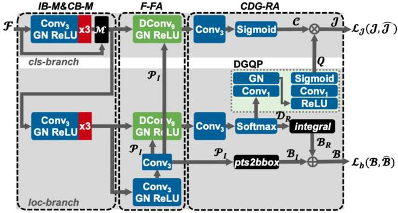

<<<<<<< HEAD
# AMA-Det: Enhancing Shared Head of One-stage Object Detector with Adaptation, Merging and Alignment [🔗 ](https://ieeexplore.ieee.org/document/9973305)

## Introduction

*Feature adaptation(FA)* and *result alignment(RA)* are critical issues in one-stage object detection, since *FA* amends feature misalignment problem by adapting sampling points to semantically significant locations, and *RA* corrects result misalignment problem by estimating the localization quality. For *FA*, the aligned and consistent prediction of sampling points is important. Previous studies directly inherit cascaded “proposal-refine” philosophy from multi-stage detectors and predict sampling points by approximating their minimal external rectangle to ground-truth bounding boxes. This manner generates poorly aligned and consistent sampling points and induces irrelevant features aggregated. Moreover, their sampling points for classification are conventionally generated through the localization branch, without feeding the corresponding features of the classification branch. For *RA*, previous studies have verified the superiority of utilizing the predicted edge distribution to estimate localization quality; however, their directly regressed distribution is incompatible with the cascaded regression framework. To solve these problems, we firstly propose a *focused feature adaptation* method by softening the supervision of the proposal points. This method can predict sampling points focused above the assigned objects with excellent alignment and consistency. Subsequently, *inner-branch and* *cross-branch merging* were investigated to promote feature sharing from the classification branch. Finally, *cascaded distribution-guided result alignment* is advanced and verified to predict accurate localization quality. After integrating our proposed adaptation, merging, and alignment, we created AMA-Det with an enhanced shared head, which impressively reaches 43.9 mAP with ResNet50 as the backbone. AMA-Det also achieves a 54.5 mAP by multi-scale testing on MSCOCO test-dev and outperforms all existing CNN-based one-stage counterparts.



## Installation

Please refer to [get_started.md](docs/get_started.md) for installation.

## Notation

🐞 **AMA-Det**  was originally named **serialgfl** or **FAQE** in this project. This release does not strictly correct the name.

## Train

```shell
# assume that you are under the root directory of this project,
# and you have activated your virtual environment if needed.
# and with COCO dataset in '/share/Datasets/coco/'

./run.sh
```

## Inference

```shell
./tools/dist_test.sh ./configs/serialgfl/serialgfl_r50_fpn_1x_coco_\[DGQP-c64\].py ./work_dirs/serialgfl_r50_fpn_1x_coco_\[DGQP-c64\]/epoch_1.pth 8 --eval bbox
```

## Test

```shell
./test.sh
```

# Models

| Model      | Multi-scale training | mAP (minival) | mAP(test-dev) | Link                                                         |
| ---------- | -------------------- | ------------- | ------------- | ------------------------------------------------------------ |
| R50-FPN-1x | No                   | 43.9          |               | [Google](https://drive.google.com/file/d/1Y_SiJsj-v2rQBhOpfAelKSrZp6xK7vNe/view?usp=share_link) |
| R50-FPN-2x | Yes                  | 46.6          |               | [Google](https://drive.google.com/file/d/1SS5NMsPrDaJ2UOVN64IMIInkqRYydqds/view?usp=share_link) |

## Acknowledgement

Thanks **MMDetection** team for the wonderful open source project!

## Citation

If you use this toolbox or benchmark in your research, please cite this project.

```
@article{cheng2022ama,
  title={AMA-Det: Enhancing Shared Head of One-Stage Object Detection With Adaptation, Merging, and Alignment},
  author={Cheng, Song and Li, Feng-Yue and Qiao, Shu-Shan and Shang, De-Long and Zhou, Yu-Mei},
  journal={IEEE Access},
  volume={11},
  pages={11377--11389},
  year={2022},
  publisher={IEEE}
}
```

=======
# AMA-Det: Enhancing Shared Head of One-stage Object Detector with Adaptation, Merging and Alignment

## 🚀 Uploading in progress...
>>>>>>> 6008168cfd9ab36221cd615b62baee6d48af87d5
